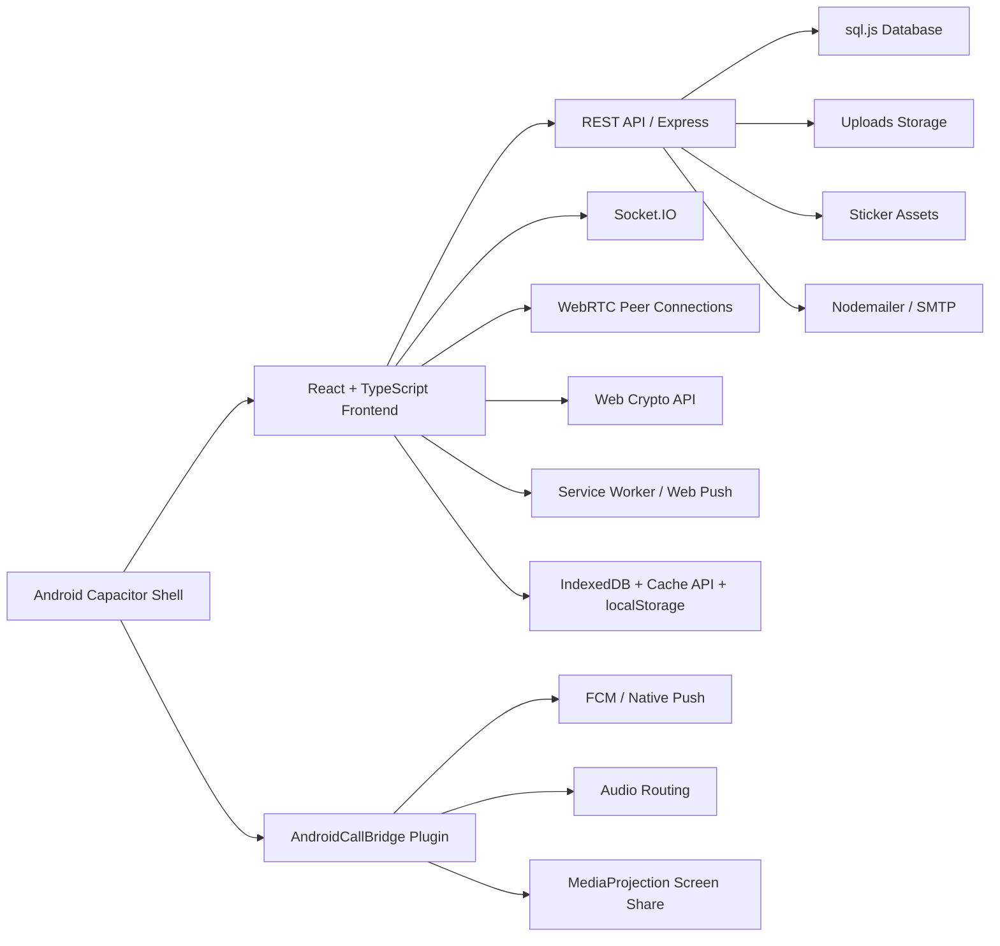

# Karas Messenger: полная документация по проекту

## 1. Позиционирование проекта

**Karas Messenger** это кроссплатформенный мессенджер с акцентом на приватность, real-time коммуникации и мобильный сценарий использования. Проект объединяет веб-клиент, backend, Android shell и собственный нативный Android bridge.

С точки зрения продукта это не просто чат, а **готовая коммуникационная платформа**, которая уже закрывает:

- личные и групповые переписки;
- каналы и публикации;
- безопасную передачу сообщений;
- аудио- и видеозвонки;
- групповые звонки;
- push-уведомления;
- передачу файлов и медиа;
- голосовые сообщения и round video;
- расширяемый слой стикеров;
- Android-native сценарии, которых обычно нет у обычного PWA.

## 2. Ключевая ценность

### 2.1. Что делает проект сильным

- **E2EE для личных диалогов.** Сообщения 1-to-1 шифруются на клиенте и дешифруются только на устройстве участника.
- **Единая кодовая база для web и Android.** Основная логика находится в React-приложении, а Android получает дополнительные нативные возможности через Capacitor plugin.
- **Гибридная модель уведомлений.** В браузере используется Web Push, в Android shell используется FCM.
- **Полноценный real-time слой.** Presence, typing, read receipts, live message sync, signaling для звонков.
- **Сильная мобильная ориентация.** PWA-поведение, Android shell, safe areas, system back, mobile-first сценарии.
- **Свой нативный слой.** Аудиомаршрутизация, Android share intents, screen capture, APK sharing, очистка уведомлений по чату.

## 3. Что уже умеет продукт

### 3.1. Пользовательские функции

- регистрация и логин;
- смена пароля;
- восстановление пароля по email;
- редактирование профиля;
- личные чаты;
- групповые чаты;
- каналы;
- подписка на канал по ссылке;
- отправка текстовых сообщений;
- отправка файлов;
- отправка изображений, видео и аудио;
- voice messages;
- round video messages;
- редактирование сообщений;
- удаление сообщений;
- реакции;
- ответы на сообщения;
- пересылка сообщений;
- поиск по сообщениям;
- навигация по датам;
- просмотр медиа;
- блокировка пользователей;
- pin и mute-настройки чатов;
- online/offline presence и last seen;
- typing indicators;
- read receipts;
- личные звонки audio/video;
- групповые звонки;
- screen sharing;
- переключение камер;
- переключение аудиовыхода;
- подавление шума микрофона;
- browser push;
- Android native push;
- каталог стикеров;
- favorites, recent и frequent stickers;
- создание собственных стикеров;
- импорт sticker packs из Telegram;
- системный канал обновлений;
- Android incoming share;
- install landing для мобильной установки.

### 3.2. Ограничения текущей версии

- E2EE действует для **личных чатов**, не для групп и каналов.
- Групповые звонки организованы peer-to-peer и не используют SFU.
- iOS работает как PWA, отдельного native shell нет.
- Backend использует `sql.js`, что отлично подходит для MVP и простого деплоя, но не является финальной high-load стратегией хранения.

## 4. Архитектура

### 4.1. Общая схема



### 4.2. Слои решения

#### Клиент

Клиент реализует:

- весь UI;
- глобальное состояние чатов и сообщений;
- optimistic UI;
- локальную дешифровку E2EE;
- управление звонками;
- управление уведомлениями;
- работу со стикерами и локальным кешем;
- mobile navigation и mobile UX.

Центральный orchestrator: [src/App.tsx](C:\Users\dimak\Documents\GitHub\messenger\src\App.tsx)

#### Backend

Сервер решает:

- аутентификацию и авторизацию;
- CRUD по чатам, сообщениям, пользователям и группам;
- прием файлов;
- хранение sticker catalog state;
- push delivery;
- signaling для звонков;
- хранение и миграции БД.

Точка входа: [server/src/index.ts](C:\Users\dimak\Documents\GitHub\messenger\server\src\index.ts)

#### Android-native слой

Нативная часть нужна не только для упаковки web UI в APK. Она добавляет:

- управление аудиовыходами и аудиовходами;
- нативный screen capture;
- обработку share intents;
- шаринг APK;
- интеграцию с Android notification behavior;
- проверку runtime capabilities;
- автоматический запрос разрешений на медиа.

## 5. Технологический стек

### 5.1. Frontend

| Технология | Назначение |
|---|---|
| React 19 | UI и компонентная архитектура |
| TypeScript | типобезопасность |
| Vite | быстрая разработка и сборка |
| Socket.IO Client | real-time события и signaling |
| WebRTC | звонки и screen sharing |
| Web Crypto API | E2EE |
| IndexedDB | локальный storage для sticker manifests |
| Cache API | кеширование sticker assets |
| localStorage | токен, тема, preferences, ключи, call history |
| Service Worker + Push API | browser push |
| Sentry | observability |
| emoji-picker-react | emoji UI |
| lottie-web | animated stickers |
| RNNoise worklet | подавление шума |

### 5.2. Backend

| Технология | Назначение |
|---|---|
| Node.js | runtime |
| Express | REST API |
| Socket.IO | signaling и события |
| sql.js | встроенное хранение данных |
| bcryptjs | хеширование паролей |
| jsonwebtoken | JWT auth |
| multer | загрузка файлов |
| web-push | browser push |
| firebase-admin | Android FCM |
| nodemailer | password reset emails |
| uuid | генерация идентификаторов |

### 5.3. Mobile / Native

| Технология | Назначение |
|---|---|
| Capacitor | Android shell |
| Capacitor Push Notifications | native push permissions и registration |
| Capacitor StatusBar/App | shell integration |
| Android MediaProjection API | нативный screen capture |
| Android AudioManager | routing звука |
| Android FileProvider | безопасный APK/file share |

## 6. Готовые решения и собственные решения

### 6.1. Готовые решения

Проект стоит на хороших индустриальных опорах:

- React/Vite для UI-платформы;
- Express для API;
- Socket.IO для событийной модели;
- WebRTC для звонков;
- Web Crypto для шифрования;
- Capacitor для Android shell;
- Firebase Admin и web-push для уведомлений;
- RNNoise для улучшения звука;
- Lottie и emoji-picker для UX слоя.

### 6.2. Собственные решения

Именно они делают проект сильным как продукт:

1. **Свой E2EE слой** для direct chats с backup приватного ключа только в зашифрованном виде.
2. **Собственная гибридная push-модель**, объединяющая web и Android native.
3. **Свой Android bridge**, реализующий реальные мобильные сценарии, а не только упаковку сайта.
4. **Собственный sticker subsystem** с каталогом, кешем, user state, favorites и Telegram import.
5. **Свой orchestration-слой в App.tsx**, который связывает real-time события, дешифровку, optimistic UI и mobile flows.
6. **System updates channel** с автоматической подпиской и opt-out логикой.

## 7. Ключевые сценарии работы

### 7.1. Регистрация

Во время регистрации клиент:

- генерирует ECDH key pair;
- экспортирует public key;
- шифрует private key пользовательским паролем;
- отправляет на сервер public key и encrypted private key backup;
- сохраняет private key локально.

Сервер:

- создает пользователя;
- сохраняет зашифрованный backup ключа;
- выдает JWT;
- подписывает пользователя на системный канал обновлений.

### 7.2. Логин

Во время логина:

- сервер возвращает JWT, профиль и key backup;
- клиент пробует расшифровать backup введенным паролем;
- при успехе private key сохраняется локально и E2EE становится активным.

### 7.3. Отправка E2EE-сообщения

Для личного чата:

1. клиент получает public key собеседника;
2. derive'ит shared key;
3. шифрует текст через AES-GCM;
4. отправляет ciphertext + iv;
5. получатель дешифрует сообщение локально.

Для групп и каналов текущая версия E2EE не применяет.

### 7.4. Получение сообщения

На событии `message:new` клиент:

- обновляет preview чата;
- обновляет unread counters;
- при необходимости показывает notification;
- если чат открыт, сразу вставляет сообщение в ленту;
- если direct message зашифрован, запускает локальную дешифровку.

### 7.5. Звонки

Индивидуальные звонки строятся через:

- Socket.IO для signaling;
- WebRTC для медиа;
- отдельный call context для state management;
- генерацию звуков через Web Audio API;
- call history hook.

### 7.6. Групповые звонки

Сервер хранит состав комнат в памяти и:

- отправляет новому участнику список уже подключенных;
- ретранслирует offer/answer/ICE;
- синхронизирует peer-state;
- выдерживает короткий reconnect grace period при разрыве соединения.

### 7.7. Уведомления

#### В браузере

- регистрируется service worker;
- запрашивается permission;
- сервер выдает VAPID key;
- создается push subscription;
- backend доставляет payload через `web-push`.

#### На Android

- shell получает FCM token;
- backend сохраняет `push_devices`;
- push доставляется через Firebase Admin;
- native слой умеет очищать уведомления открытого чата.

### 7.8. Стикеры

Sticker subsystem поддерживает:

- стартовый каталог;
- установку и удаление packs;
- custom stickers;
- Telegram import;
- favorites/recent/frequent;
- локальный кеш манифестов и asset-файлов.

## 8. Структура репозитория

```text
messenger/
├─ src/
│  ├─ components/
│  ├─ context/
│  ├─ features/stickers/
│  ├─ hooks/
│  ├─ pages/
│  ├─ plugins/
│  ├─ utils/
│  ├─ api.ts
│  ├─ crypto.ts
│  ├─ notifications.ts
│  └─ App.tsx
├─ public/
├─ server/
│  ├─ src/
│  ├─ uploads/
│  ├─ sticker-assets/
│  └─ data.db
├─ android/
└─ docs/
```

## 9. Модель данных

Основные таблицы, создаваемые в [server/src/db.ts](C:\Users\dimak\Documents\GitHub\messenger\server\src\db.ts):

### Пользователи и безопасность

- `users`
- `password_reset_tokens`
- `blocked_users`

### Чаты и сообщения

- `chats`
- `chat_members`
- `messages`
- `message_reactions`
- `group_disabled_emojis`

### Push и настройки

- `push_subscriptions`
- `push_devices`
- `app_settings`

### Stickers

- `sticker_packs`
- `stickers`
- `user_sticker_state`

### System channel

- `system_channel_opt_outs`

## 10. REST API по блокам

### Auth

- `POST /api/auth/register`
- `POST /api/auth/login`
- `POST /api/auth/change-password`
- `POST /api/auth/request-password-reset`
- `POST /api/auth/reset-password`

### User

- `GET /api/users/me`
- `PUT /api/users/me`
- `GET /api/users/:id/public-key`
- `PUT /api/users/public-key`
- `GET /api/users/search`
- `POST /api/users/:id/block`
- `DELETE /api/users/:id/block`

### Chats and Messages

- `GET /api/chats`
- `PUT /api/chats/:id/preferences`
- `GET /api/chats/:id/messages`
- `POST /api/chats/:id/messages`
- `PUT /api/messages/:id`
- `DELETE /api/messages/:id`
- `POST /api/chats`
- `DELETE /api/chats/:id`
- `POST /api/messages/:id/reactions`

### Groups and Channels

- `POST /api/groups`
- `PUT /api/groups/:id`
- `GET /api/groups/:id/members`
- `POST /api/groups/:id/members`
- `DELETE /api/groups/:id/members/:userId`
- `PUT /api/groups/:id/members/:userId/admin`
- `GET /api/groups/:id/disabled-emojis`
- `PUT /api/groups/:id/disabled-emojis`
- `POST /api/channels`
- `GET /api/channels/:id/stats`
- `GET /api/channels/:id/preview`
- `GET /api/channels/:id/preview/messages`
- `POST /api/channels/:id/subscribe`

### Stickers

- `GET /api/users/me/stickers/state`
- `PUT /api/users/me/stickers/state`
- `GET /api/stickers/packs`
- `GET /api/stickers/packs/:id`
- `POST /api/stickers/custom`
- `PATCH /api/stickers/:stickerId`
- `DELETE /api/stickers/:stickerId`
- `POST /api/stickers/import/telegram`

### Upload and Push

- `POST /api/upload`
- `GET /api/push/vapid-public-key`
- `POST /api/push/subscribe`
- `POST /api/push/unsubscribe`
- `POST /api/push/devices/register`
- `POST /api/push/devices/unregister`

### Infra

- `GET /api/health`
- `GET /api/ice-servers`

## 11. Безопасность

### 11.1. E2EE

Проект использует:

- `ECDH P-256` для согласования общего секрета;
- `AES-GCM 256` для шифрования сообщений;
- `PBKDF2 + AES-GCM` для шифрования backup приватного ключа.

Важно:

- приватный ключ не хранится на сервере в открытом виде;
- сервер оперирует public key и encrypted backup;
- при отсутствии локального ключа E2EE direct messages остаются недешифруемыми.

### 11.2. Auth

- JWT Bearer tokens;
- bcrypt hash;
- auth middleware на защищенных маршрутах;
- password reset token хранится как hash.

### 11.3. Uploads

- whitelist расширений;
- лимит `250 MB`;
- UUID-файлы вместо исходных имен;
- выделенная папка uploads.

## 12. Android shell как конкурентное преимущество

Android часть реализует реальные native сценарии:

- системный выбор аудиовыходов;
- нативный захват экрана через `MediaProjection`;
- прием файлов из Android share menu;
- передачу APK через share-sheet;
- работу с нативными уведомлениями;
- ранний запрос camera/audio/media permissions.

Это делает проект ближе к полноценному Android messenger app, чем обычный PWA.

## 13. Observability

Через [src/sentry.ts](C:\Users\dimak\Documents\GitHub\messenger\src\sentry.ts) проект получает:

- breadcrumbs;
- captureException с тегами и контекстом;
- user binding;
- безопасную диагностику сложных мест: звонки, push, native bridge, screen sharing.

## 14. Деплой

### Frontend

- production API задается в [`.env.production`](C:\Users\dimak\Documents\GitHub\messenger\.env.production);
- сборка через `npm run build`;
- PWA assets лежат в `public/`.

### Backend

Основные env-переменные описаны в [server/.env.example](C:\Users\dimak\Documents\GitHub\messenger\server\.env.example):

- `PORT`
- `JWT_SECRET`
- `TELEGRAM_BOT_TOKEN`
- `APP_URL`
- SMTP settings
- TURN settings
- VAPID settings

Для Railway есть отдельная памятка в [server/RAILWAY.md](C:\Users\dimak\Documents\GitHub\messenger\server\RAILWAY.md).

### Android

- web build попадает в `dist`;
- Capacitor синхронизирует его в Android shell;
- shell использует собственный plugin и свой manifest.

## 15. Почему проект выглядит сильным для продажи

1. У него уже есть понятный продуктовый каркас, а не просто набор экранов.
2. Есть собственные differentiators: E2EE, native Android bridge, sticker subsystem, system updates channel.
3. Архитектура расширяема: можно наращивать модерацию, аналитику, каналы, звонки, multi-device.
4. Есть мобильная стратегия и реальный Android UX.
5. Есть техническая глубина, важная для инвестора, заказчика или white-label клиента.

## 16. Дальнейшее развитие

- переход на PostgreSQL или серверный SQLite;
- расширение E2EE на группы;
- SFU для масштабируемых group calls;
- вынесение storage в S3-compatible backend;
- moderation/admin panel;
- iOS native shell;
- device verification и multi-device key management.

## 17. Связанные документы

- каталог модулей и функций: [FUNCTION_CATALOG_RU.md](C:\Users\dimak\Documents\GitHub\messenger\docs\FUNCTION_CATALOG_RU.md)
- основной README: [README.md](C:\Users\dimak\Documents\GitHub\messenger\README.md)
